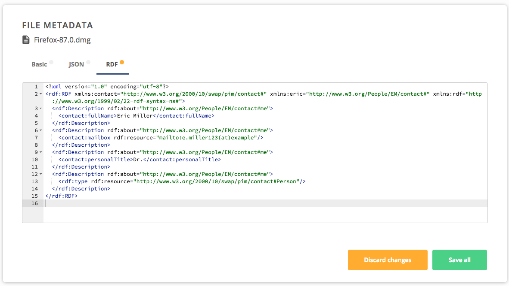

# Metadata

[[toc]]

## Quickstart

See [Web GUI](#web-gui) usage examples for the quick guide on how to set or 
obtain file/directory metadata.


## Basics

In the Onedata system, metadata is organized into 3 levels and regards every 
file/directory:

* [Filesystem attributes](#filesystem-attributes) – basic filesystem metadata 
such as file size, creation and modification timestamps, POSIX permissions, etc.
* [Extended attributes](#extended-attributes) – simple key-value pairs, 
compatible with POSIX extended attributes.
* [Custom metadata](#custom-metadata) – custom documents in JSON or RDF format.

The filesystem and extended attributes are accessible directly via 
[POSIX](#metadata-management-with-oneclient-and-onedatafs), [CDMI](cdmi.md) and 
[REST](#rest-api) protocols. Custom metadata, on the other hand, is 
accessible directly only via [REST](#rest-api) and indirectly via 
[POSIX](#metadata-management-with-oneclient-and-onedatafs) and [CDMI](cdmi.md)
(as extended attributes under special names of `onedata_json` and `onedata_rdf`).


### Filesystem attributes

Filesystem attributes are set and modified automatically as a result of various 
filesystem operations. Most of them are read-only, which means their values 
cannot be directly modified. The only exception is POSIX mode (permissions). 
All filesystem attributes are shown in table below.


Attribute           | Sample value                              | Description
--------------------|-------------------------------------------|-----------------------------------
name                | "file.txt"                                | The name of the object (Space, directory or file)
type                | "reg"                                     | Specifies whether the resource is a regular file (`reg`) or a directory (`dir`)
size                | 1024                                      | Size of the file in bytes, always 0 for directories
mode                | 0666                                      | POSIX permissions in octal form (i.e. 4 digits starting with 0)
atime               | 1470304148                                | Last access timestamp (in seconds)
mtime               | 1470304148                                | Last modification timestamp (in seconds)
ctime               | 1470304148                                | Last status change timestamp (in seconds)
storage_user_id     | 6001                                      | Uid of the storage owner of this file
storage_group_id    | 6001                                      | Gid of the storage group owner of this file (the same Gid is displayed via oneclient)
owner_id            | "6825604b0eb6a47b8b7a04b6369eb24d"        | ID of the file owner
provider_id         | "79c0ed35f32e43db3a87f76a588c9b2f"        | ID of the provider on which file was created
shares              | ["b3a87f76a588c9b279c0ed35f32e4db", ...]  | Array of share IDs associated with this file/directory

Some filesystem attributes are considered private and masked when accessing 
file in share mode (public view for unauthenticated clients). They are:
- **storage_user_id** – special value of `2147483646` is returned instead
- **storage_group_id** – special value of `2147483646` is returned instead
- **owner_id** – `"unknown"` will be returned instead
- **provider_id** – `"unknown"` will be returned instead
- **mode** – `owner` and `group` bits will be zeroed
- **shares** – only share used to access file will be shown in the array 
(the rest will be omitted)


### Extended attributes

Extended attributes are custom key-value pairs that can be assigned to any
file/directory and are compatible with POSIX extended file attributes. **Only 
numeric and string values are allowed** – for complex, nested objects, 
[custom metadata](#custom-metadata) must be used. 

In general, extended attributes are platform agnostic and users can choose 
arbitrary keys and values to be assigned, for instance information about the 
author of the file, mimetype, license, etc. One restriction is that all keys 
beginning with `onedata_` or `cdmi_` prefixes are reserved as they are used by 
the Onedata platform for special purposes, in particular for presentation in 
Graphical User Interface and Open Data publishing and management.


### Custom metadata

For each file/directory, users can assign custom documents in supported metadata formats 
(currently JSON and [RDF – Resource Description Framework](https://www.w3.org/RDF)). 
This level provides most flexibility as no specific schema is imposed. The custom 
metadata can be used to create complex [views](#creating-views-over-metadata) or 
[data discovery](#data-discovery) indices that consolidate metadata
from multiple spaces.


## Web GUI
The easiest way to create, modify and browse metadata attached to files or directories 
is using the Web GUI metadata editor. 

1. In order to edit the metadata of a file/directory, simply select **Metadata** 
from the file context menu.


2. Metadata can also be edited for entire data space, but it has to be invoked 
from the space context menu.


3. The first tab allows edition of the [extended attributes](#extended-attributes)
in a simple key-value editor.


4. In the second tab, JSON metadata can be edited in place or pasted into the 
editor, which performs live syntax validation.


5. The third tab contains an RDF editor that works similarly, 
but accepts triples in the XML format.




## Metadata management with Oneclient and OnedataFS

In an Oneclient mount, the metadata is exposed through the extended file 
attributes. It can be accessed and modified using such tools as 
[xattr](https://github.com/xattr/xattr) or `getfattr`:


```bash
[/mnt/oneclient/Space1]$ ls
file.json

[/mnt/oneclient/Space1]$ xattr -l file.json
license: CC-0
onedata_json: {"author":"John Doe"}
onedata_rdf: <rdf>metadata_1</rdf>
org.onedata.guid: Z3VpZCM0MmUzYmM5ZmE4ZWYyNjE1ZjAzMjdjMGZmOThkNTk2OGNoYWVlNSM0MWRlYmNmNzI5MTYxNGVkNjRhZjU2YjBmOGM4NTIyOGNoYWVlNQ
org.onedata.file_id: 000000000052036A67756964233432653362633966613865663236313566303332376330666639386435393638636861656535233431646562636637323931363134656436346166353662306638633835323238636861656535
org.onedata.space_id: 41debcf7291614ed64af56b0f8c85228chaee5
org.onedata.storage_id: c7753c5b7c67120fec9c6f412b9dcb9cchd3ec
org.onedata.storage_file_id: /41debcf7291614ed64af56b0f8c85228chaee5/file.txt
org.onedata.access_type: direct
org.onedata.file_blocks: [##################################################]
org.onedata.file_blocks_count: 1
org.onedata.replication_progress: 100%

[/mnt/oneclient/Space1]$ xattr -w license CC-1 File2.txt
```

Please note that the extended attributes starting with `org.onedata.` prefix are 
Onedata system attributes and cannot be modified. They provide useful information 
about files:

* `org.onedata.guid` – the internal GUID of a file/directory in Onedata
* `org.onedata.file_id` – the universal [File ID](data.md#file-path-and-id) which can be used in REST or CDMI APIs
* `org.onedata.space_id` – the ID of the space to which this file/directory belongs
* `org.onedata.storage_id` – the storage ID on which this file is located
* `org.onedata.storage_file_id` – the internal storage file identifier (e.g. file path on POSIX storage)
* `org.onedata.access_type` – type of access available for this file:
    * `direct` – the client has direct access to the storage (e.g. S3 bucket or Ceph pool)
    * `proxy` – the direct access is not available and all read and write requests will 
                transfer the data through a network connection with Oneprovider
    * `unknown` – the data access type has not been established yet (it is done 
                  only on the first I/O operation on a storage from given mountpoint)
* `org.onedata.file_blocks` – ascii art visualizing the distribution of file blocks 
which are available on the provider where the oneclient is mounted
* `org.onedata.file_blocks_count` – the number of file blocks which are available 
on the provider where the oneclient is mounted
* `org.onedata.replication_progress` – the percentage of file blocks which are 
available on the provider where the oneclient is mounted

Similarly to Oneclient, extended attributes and metadata can be accessed and modified 
from the OnedataFS Python interface:

```bash
from fs.onedatafs import OnedataFS
onedata_provider_host = "..."
onedata_access_token = "..."

# Create connection to Oneprovider
odfs = OnedataFS(onedata_provider_host, onedata_access_token)

# Open selected space directory
space = odfs.opendir('/Space1')

# List SpaceA contents
space.listdir('/')
['file.json']

# List extended attributes names for `file.json`
space.listxattr("file.json")
['license',
 'onedata_json',
 'onedata_rdf',
 'org.onedata.guid',
 'org.onedata.file_id',
 'org.onedata.space_id',
 'org.onedata.storage_id',
 'org.onedata.storage_file_id',
 'org.onedata.access_type',
 'org.onedata.file_blocks_count',
 'org.onedata.file_blocks',
 'org.onedata.replication_progress']

space.getxattr("file.json", "org.onedata.space_id")
b'"f733305f7a0a81dce39666713a516f0b"'

space.setxattr("file.json", "license", '"MIT"')

space.removexattr("file.json", "license")
```


## REST API

All operations related to file metadata can be performed using the REST API.
Please refer to the linked API documentation for detailed information and examples.

| Operation                                    | Link to API |
|----------------------------------------------|-------------|
| Read filesystem attributes                   | [API](https://onedata.org/#/home/api/latest/oneprovider?anchor=operation/get_attrs)|        
| Set filesystem attributes                    | [API](https://onedata.org/#/home/api/latest/oneprovider?anchor=operation/set_attr)|        
| Manage extended attributes & custom metadata | [API](https://onedata.org/#/home/api/latest/oneprovider?anchor=tag/Custom-File-Metadata)|        


## Creating views over metadata

Please refer to [views documentation](./views.md) for instructions on 
how to create complex database views over data collections using metadata.


## Data discovery

File and directory metadata can be used to feed [data discovery](data-discovery.md) 
indices that harvest metadata from multiple spaces and provide advanced search engines.
