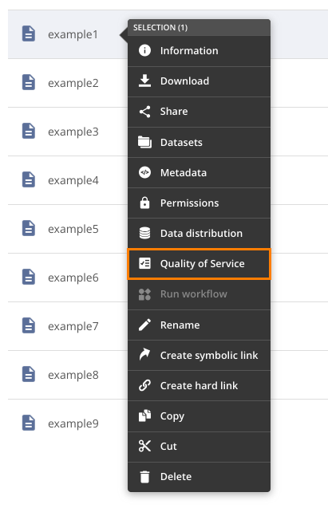
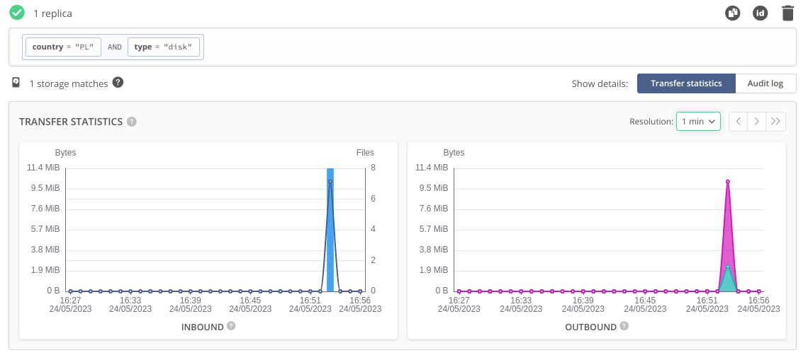

# Quality of Service

[toc]

## Basics

Quality of Service functionality in Onedata is used to manage file replica distribution and redundancy
between supporting Oneproviders. Users can define any number of QoS requirements for a file or directory.
Each requirement consists of target replicas number and an expression that is used to select storages
where the replicas should be placed ‐ it is matched against parameters that were assigned to storages
by Oneprovider admins.

If required, data transfers are automatically triggered to satisfy the QoS requirements - remote
changes made to file content are automatically reconciled. File replicas corresponding to QoS requirements
are protected from eviction.

Removing a QoS requirement does not automatically remove the replicas that were created during its
lifetime, but they are no longer protected.


## QoS expression
QoS expressions are a declarative way of specifying desired storage parameters in a unified format.

Operands in expression must be in form `key {comparator} value`, where `{comparator}` is one of `<, >, <=, >=, =`, 
e.g. `key = value`. One exception from this is operand `anyStorage`. If any comparator other than `=` is used, only 
numeric values are allowed.

Operands can be combined with the use of one of supported operators:
* `&` - results in storages that match expressions on both sides of this operator
* `|` - results in storages that match at least one expression on both sides of this operator
* `\ ` - results in storages that match expression on left side of this operator and do not match expression on the 
right side of operator

Example QoS expressions:  
* `geo=PL` - any storages in Poland  
* `timeout < 8` - storages with timeout parameter set to less than 8
* `timeout = 8` - storages with timeout parameter set to exactly 8
* `geo=PL & type=disk` - disk storages located in Poland  
* `geo=PL | type=disk` - storages located in Poland or disk storages anywhere  
* `anyStorage \ type=disk` - any storages that are not of disk type  


Operands and nesting can be used to combine simple expressions into complex ones, e.g:  
* `geo=FR | (geo=PL & type=disk)` - any storages in France or disk storages located in Poland  
* `(geo=PL \ type=disk) | (geo=FR & type=disk)` - storages in Poland that are not of disk type or storages in 
France that are of disk type

## QoS requirements
QoS requirement consists of a [QoS expression](#qos-expression) and a desired number of replicas.
It can be added for a single file or a whole directory (in such case all nested subfiles and
subdirectories are affected). The QoS expression is used to select matching storages where the
replicas will be placed - until the specified target number of replicas is satisfied.
The replicas are automatically managed ‐ protected from eviction and reconciled upon changes
to the file content.

Fulfillment of a QoS requirement is indicated by its `status`:
* `fulfilled` - desired number of replicas have been created on matching storages and their contents
 are up-to-date (remote changes have been reconciled).
* `pending` - the requirement is not yet fulfilled - data replication is still ongoing.
* `impossible` - there are not enough storages matching the expression to meet the required number
  of replicas, hence the requirement cannot be satisfied - unless the list of supporting storages
  or their parameters change.

## Using web GUI

Quality of Service can be managed in the web GUI. Look for the Quality of Service in the file/directory's context menu.



In *Quality of Service* modal requirements for selected file/directory can be managed.  


To add new QoS requirement number of required replicas and [QoS expression](#qos-expression) need to be given.  


QoS expression can be provided as plain text (useful when pasting copied expression) or can be constructed 
using built-in graphical editor.  

  

Editor provides suggestions for each key/value, based on existing storage parameters.  

  

You can see status and transfer statistics for each of QoS requirements.




On the charts you can see total number of files as well as number of bytes that where transferred to fulfill this 
requirement. 

::: warning
All QoS charts are seen from the point of view of currently selected provider.
:::

#### INBOUND chart
* `Files` represent number of regular files that were processed to fulfill QoS requirement. When single file was 
transferred multiple times (e.g. when file content was changed multiple times on remote provider) each of these 
transfers contributes towards this counter. This means that single file can be counted multiple times. Empty 
files also increase this counter. 
* `Bytes` represent number of bytes that have been saved on local storages in order to fulfill this QoS requirement.

#### OUTBOUND chart
* `Bytes` represent number of bytes that have been transferred **from** each remote storage. Sum of these values is equal 
to Bytes value shown in the `INBOUND` chart.

## Using REST API

Below are some examples how the REST API can be used to manage QoS requirements. For
detailed documentation of all endpoints, refer to the
[API documentation](https://onedata.org/#/home/API/latest/oneprovider?anchor=tag/QoS).

Below examples assume that the following environment variables are exported:

```bash
REST_API="https://<oneprovider-domain>/API/v3/oneprovider"
AUTH_HEADER="x-auth-token: <your-access-token>"
CT="content-type: application/json"
```

These endpoints can be used by a space member with manage QoS privileges to manage desired requirements.

<!-- @TODO VFS-6428 Add examples of retrieving storage qos parameters -->

#### Adding new QoS requirement

Prepare the ID of the file/directory to which you want to add your QoS requirement.
It can be found in the file browser GUI (`Information` in file/directory's context menu)  or
using the [lookup file ID endpoint](./rest-and-cdmi-api.md#file-paths):

```bash
curl -H "${AUTH_HEADER}" -X POST {$REST_API}/lookup-file-id/test-space/directory/file.txt
```

```bash
{"fileId":"000000000052732467756964236431303233303132616362346233373463306263626339666535303630343135636861356536236334613030626466613534643064636666656335633430313039633762663635636861356536"}
```

Assuming that the file ID is stored in $FILE_ID variable, you can add a QoS requirement:

```bash
curl -H "${AUTH_HEADER}" -H "${CT}" -X POST {$REST_API}/qos_requirement/ -d '{
"expression": "geo=FR | (geo=PL & type=disk)",
"replicasNum": 2,
"fileId": "$FILE_ID"
}'
```

In response, you will receive the ID of your newly created QoS requirement:

```bash
{
    "qosRequirementId": "c4bb03e7ae90d9886cbb68e6a08312c7ch08f5"
}
```

#### Getting QoS requirement details

Getting details of a QoS requirement can be achieved with querying following endpoint:

```bash
curl -H "${AUTH_HEADER}" -X GET {$REST_API}/qos_requirement/$QOS_REQ_ID
```

```bash
{
  "status": "pending",
  "replicasNum": 2,
  "qosRequirementId": "c4bb03e7ae90d9886cbb68e6a08312c7ch08f5",
  "fileId": "000000000052732467756964236431303233303132616362346233373463306263626339666535303630343135636861356536236334613030626466613534643064636666656335633430313039633762663635636861356536",
  "expression": "geo=FR|(geo=PL&type=disk)"
}
```

#### Deleting QoS requirement

QoS requirement can be deleted like this:

```bash
curl -H "${AUTH_HEADER}" -X DELETE {$REST_API}/qos_requirement/$QOS_REQ_ID
```

#### QoS summary for a file

QoS summary contains information of all requirements (added directly or to any ancestor directory) for given file.

```bash
curl -H "${AUTH_HEADER}" -X GET {$REST_API}/data/$FILE_ID/qos_summary
```

```bash
{
  "requirements": {
    "c4bb03e7ae90d9886cbb68e6a08312c7ch08f5": "pending",
    "a77d55692d4b0216ceccc4b83e47cca3ch08f5": "fulfilled"
  },
  "status": "pending"
}
```
Response fields are explained in the [API documentation](https://onedata.org/#/home/API/latest/oneprovider?anchor=operation/get_file_qos_summary).

