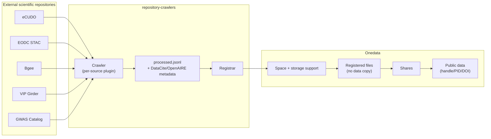

# Repository crawlers

[toc][]

## In a nutshell

`repository-crawlers` is a standalone tool for **automatic discovery and
registration of public scientific datasets in Onedata**. It harvests dataset
metadata from external scientific repositories (such as institutional data
portals, Earth Observation catalogs, or life sciences databases) and registers
the discovered datasets in Onedata — without copying the underlying data.

The tool is designed for data stewards and operators who want to expose
externally hosted, public datasets through Onedata, making them discoverable
and accessible in the system.

::: tip NOTE
Repository crawlers are an **external program**, not a built-in Onedata
component. They interact with Onedata exclusively through its public REST APIs
and rely on standard Onedata mechanisms — [file registration][], [shares][],
and (optionally) handle services to publish datasets as [public data][].
:::

## How it works

The tool is composed of two cooperating components:

* **Crawlers** — a pluggable framework that fetches dataset descriptions from a
  specific external source, normalizes them, and produces a JSONL file with
  Onedata-ready records (including standardized [DataCite][] or [OpenAIRE][]
  metadata for each dataset).
* **Registrar** — takes the JSONL output of a crawler and creates the
  corresponding resources in Onedata: a target [space][], the necessary
  storage support, registered files, [shares][], and — if a handle service is
  configured — public data records with persistent identifiers.

Files are exposed through Onedata using the [file registration][] mechanism —
data stays on the original external storage and is fetched on demand whenever
a user accesses it through Onedata.

## Supported data sources

The framework ships with plugins for several public scientific repositories,
including:

* [**eCUDO.pl**][1] — Polish university scientific datasets,
* [**EODC**][2] — Earth Observation Data Centre (STAC),
* [**Bgee**][3] — gene expression database,
* [**VIP**][4] — Virtual Imaging Platform datasets,
* [**GWAS Catalog**][5] — curated traits and publications
  (TopAnat workflow).

New sources can be supported by adding a plugin — see the project repository
for the plugin development guide.

## Installation and usage

The tool is distributed as a separate project. For installation instructions,
CLI reference, plugin development guide, and configuration details, see the
project on [GitHub][].

A typical workflow consists of three steps:

1. **Crawl** a chosen source to produce a JSONL file with dataset metadata.
2. **Review** the generated records and the registration plan.
3. **Register** the datasets in Onedata using the registrar.

::: tip NOTE
Registering datasets requires an Onedata [space][] supported by an
[imported storage][] with [manual import mode][] — the same prerequisites as
regular [file registration][]. The registrar can create and configure such a
space automatically if granted appropriate permissions.
:::

<!-- references -->

[toc]: <>

[GitHub]: https://github.com/onedata/repository-crawlers

[file registration]: ./file-registration.md

[shares]: ./shares.md

[space]: ./spaces.md

[public data]: ./public-data.md

[DataCite]: https://datacite.org/

[OpenAIRE]: https://www.openaire.eu/

[imported storage]: ../admin-guide/oneprovider/configuration/storage-backends.md#imported-storage

[manual import mode]: ../admin-guide/oneprovider/configuration/storage-import.md#manual-storage-import

[1]: http://ecudo.pl

[2]: https://eodc.eu

[3]: https://bgee.org

[4]: https://vip.creatis.insa-lyon.fr

[5]: https://www.ebi.ac.uk/gwas/
